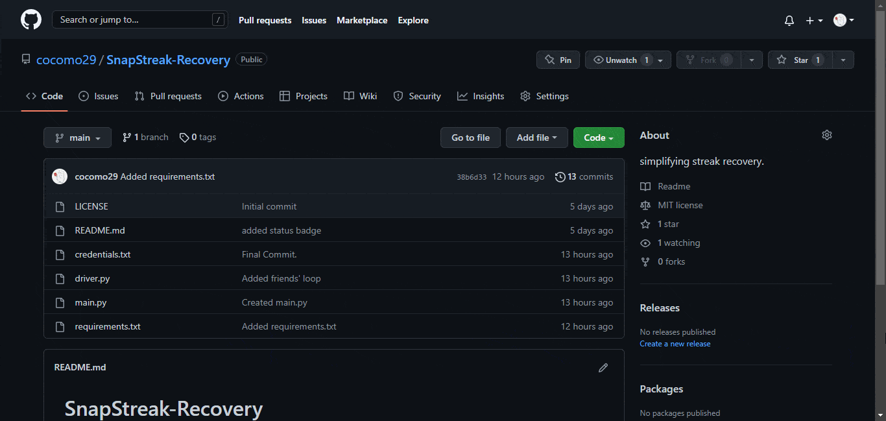
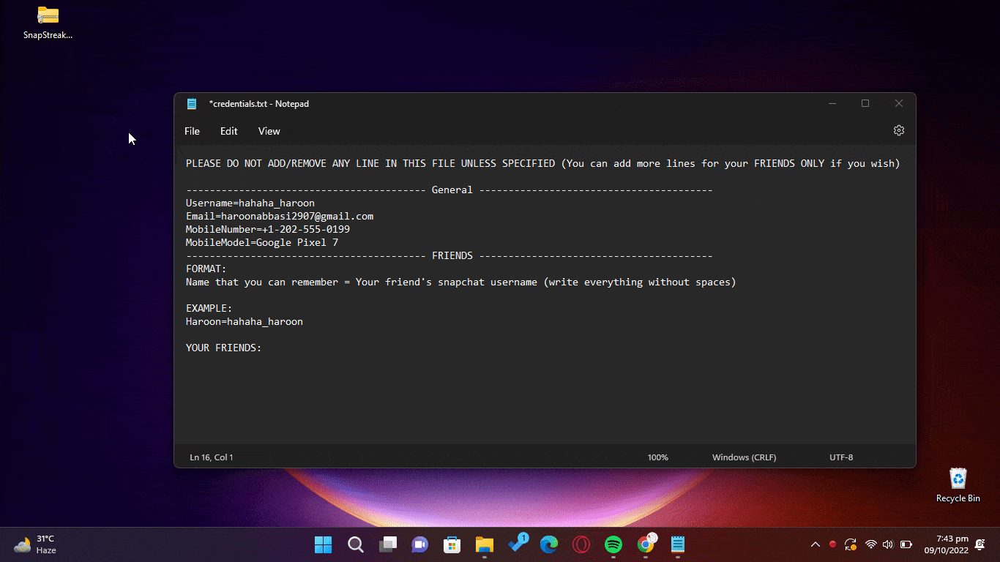
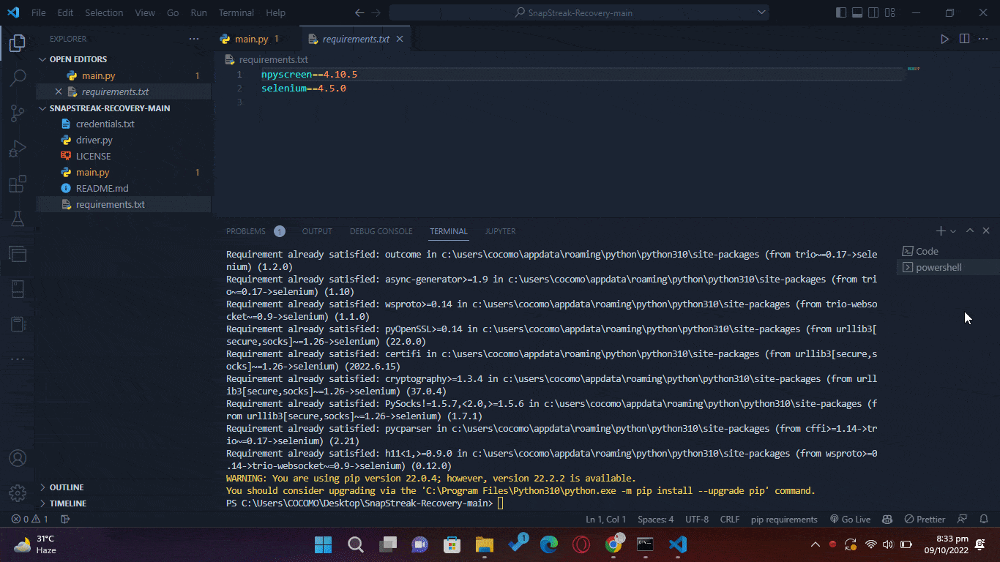

# 🔥 SnapStreak-Recovery
we all know how frustrating it can be to recover multiple streaks at the same time, this program eases that for you. All you have to do is write your friends' name (that you can remember) and their **snapchat username** in [credentials.txt](credentials.txt) once and you are all set, just run [main.py](main.py) whenever you need to recover streaks and the program will do the rest for you.

# ⚙️ Prerequisites

- You need to have python installed. You can install it from microsoft store or follow this [guide](https://www.geeksforgeeks.org/how-to-install-python-on-windows/).
- You must have web driver installed. You can download it from [here](https://chromedriver.chromium.org/downloads). Make sure to download the version that matches your chrome version. You can check your chrome version by going to `chrome://settings/help` in your browser. Remember the path where you download the driver because you'll have to add that path in [driver.py's](driver.py) line 18, its usually in `C:\Program Files (x86)\chromedriver.exe`  or  `C:\Program Files (x86)\Google\Chrome\Application\chromedriver.exe`  

# 🧑‍🏫 How to use

### 1. Download the files

### 2. Extract the files

### 3. Edit credentials.txt  

**FOLLOW THE INSTRUCTIONS CAREFULLY**

### 4. Install the requirements

- Open the folder in your favourite text editor, I am using [vscode](https://code.visualstudio.com/).  
- Run  `pip install npyscreen` and  `pip install selenium`.  
- Or simply run  `pip install -r requirements.txt` to install both requirements automagically.

### 5. Run main.py

Thats it! You are ready to go.  
Just run [main.py](main.py) whenever you need to recover streaks and the program will do the rest for you.

# Troubleshooting
If you are facing any problems, feel free to open an issue or contact me on discord: `cocomo#5215`  
More often than not, the problem is with the web drivers. Make sure you have the correct version of web drivers installed and you are following the format specified in [credentials.txt](credentials.txt).

# features in futute
If possible, I'll try to add captcha bypass but if you really need an immediate solution, you can use services like [2captcha](https://2captcha.com/).

